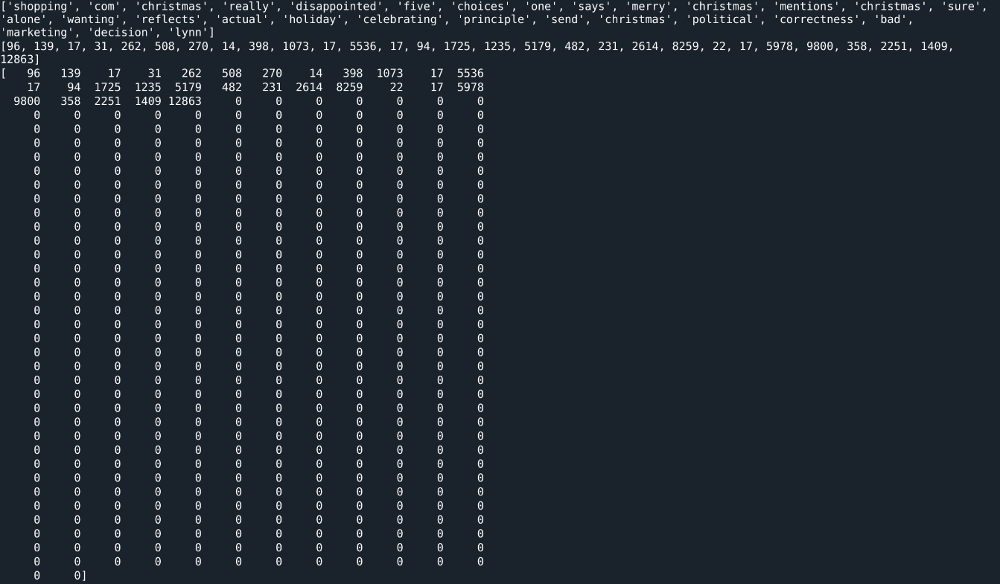

**Sentiment Analysis**

**Part I: Research Question.**

For a company to retain its customers and keep them happy, it must be able to quickly analyze feedback from its customers and address any legitimate issues and concerns in a prompt manner.

**A1.**

Using Neural Network Models, and NLP techniques, is it possible to analyze customer reviews so that the company can take actions to address issues and concerns found in the reviews?

**A2.**

The goal is to use NLP and neural networks to analyze existing user reviews of a product (in this case Amazon Gift cards) to see if we can predict how a user feels about the product based on the word choice and sentence structure of the review.

**A3.**

I will be using a Feedforward Neural Network (FNN), which is a type of Deep Neural Network (DNN).

It is an artificial neural network in which connections between the nodes do *not* form a cycle.

The architecture includes:

An Embedding layer that converts the input word tokens into dense vectors of fixed size.

A GlobalAveragePooling1D layer that computes the mean of the values in the input sequence, effectively reducing the sequence length to a single value per input channel.

Two Dense layers with 'Relu' activation functions, which serve as hidden layers in the network.

A final Dense layer with two output units and a 'sigmoid' activation function, which classifies the input text into one of the two sentiment classes (positive or negative).

This FNN architecture is designed for text classification, specifically for sentiment analysis.

I will be using the neural network to analyze sentiment data in an amazon gift Card dataset.

**Part II: Data Preparation**

**B1.**

*Presence of unusual characters*

To process our data accurately we need to get rid of items, symbols and characters that may be part of the review text, like punctuation and emojis.

Excluding regular English characters as well as numerical digits, the “special characters” found in the reviews are:

**',', '\\n', ' ', '.', "'", '"', '!', '?', ':', ')', '/', '-', '\$', ';', '+', '(', ']', '\<', '%', '&', '\*', '\#', '\>', '@', '=', '_', '\^', '[', '\~', '}', '\`', '\\\\', '{', '\|'**

This is a screenshot of the code I used to identify these characters and later remove them.

Please note that I’m removing all punctuation and special characters that are components of emojis, (e.g. ‘:’,’-’ and ‘)’ put together form 😊 which is the happy face emoji) for the sake of simplicity. Punctuation and special character can also interfere with tokenization.

Also, removing punctuation and special characters can help normalize the text data, ensuring that different variations of the same word are treated as the same token. For example, consider the words "don't" and "dont" – removing the apostrophe allows the model to treat them as identical tokens

As I tune my model in the future, I may include punctuation and emojis to improve the analysis of the sentiment being conveyed.

*d213task2_trim['reviewText_lower_words_only'] = d213task2_trim['reviewText_lower_words_only'].str.replace('\\W', ' ', regex=True) \# replace non word characters*

*d213task2_trim['reviewText_lower_words_only'] = d213task2_trim['reviewText_lower_words_only'].str.replace("[0-9]", ' ', regex=True) \# replace all digits*

*Vocabulary size*

Tokenization is the process of breaking a sentence/phrase to individual words/characters.

After removing stop words from our text and breaking down the sentences into individual words through word tokenization, we are ready to count the number of unique words to determine the vocabulary size using this code:

The result is:

Vocabulary size: 24650

*Proposed word embedding length*

When building our models, we are at liberty to set the embedding dimensions as we please, but a good rule of thumb is to take the 4th root (i.e., the square root of the square root) of the vocabulary size and round it up to the nearest whole number. This is achieved by using this code:

*vocab_size = len(tokenizer.word_index) + 1*

*print(vocab_size)*

*max_sequence_embedding = int(round(np.sqrt(np.sqrt(vocab_size)), 0))*

*print(max_sequence_embedding)*

*Statistical justification for the chosen maximum sequence* (sentence) *length*

The reviews we are analyzing are of different sizes and sentence length. After tokenization, each sentence will need to be padded, so that each sentence is of the same size and can fit the matrix. Therefore, it makes sense to pick the longest sentence or sequence as my maximum sequence length. That way I am not truncating any sentence. The code to determine the maximum sequence (sentence) length is:

And this is the result:

The maximum length of our sequences (sentence) would be: 60

The median length of our sequences (sentence) would be: 1.0

The minimum length of our sequences would be: 0

So, based on these statistics I will be using 60 as my maximum sequence (sentence) length.

**B2.**

Tokenization is the process of breaking down the text into smaller sizes or tokens. We have done this a couple of times already, when we performed word tokenization to determine the vocabulary size as well as sentence tokenization for the max sequence length. That code again:

And for the sentence tokenization:

Please note that for sentence tokenization, I used *“from gensim.summarization.textcleaner import split_sentences”* not nltk and you need to pip install gensim==3.8.3 The default v 4x doesn’t work as intended and is not supported.

I selected this sentence tokenization module because I like the way it handles punctuation. For example, it recognizes characters like “exclamation points” (!) as end of sentences by default without any need for tweaking. NLTK by default will not recognize an exclamation point at the end of a sentence. Therefore, I believe *gensim.summarization.textcleaner* is more comprehensive and accurate.

**B3.**

When we are encoding our numeric sequence representations of the text data, our sentences lengths will not be uniform. This is why we will need to select a maximum length for sentences and pad unused sentence positions in shorter sentences with a padding character, typically ‘0’. In our case, our maximum sentence length (maxlen) will be determined by searching all our reviews sentences for the one that has the most tokens. This will be our maximum length, so that we don’t truncate any sentences. Screenshots of the code as well as the first row, raw text, encoded text, and then padded encoded text follow:

From the image below, you can see that the first review is 29 words while a maxlen of 434 means there was at least one review that 434 words. One tensor could end up having a few words (tokens), while in this case, the largest tensor would have 434 words. Without padding, the shapes of the tensors would vary widely and would make it difficult to process in the neural network. Padding is the process of adding extra empty tokens to so that the tensors have the same dimensions. In this case, we pad with the number 0 at the end of the existing tokens. So, if I sentence initially has only 34 words, we will add 400 zeros to give it the same dimensions as the largest review which already had 434 words. The different tensors can now be accurately compared to each other since they are the same length after padding. This type of padding is called “post padding”, since I add the zeros at the end of the existing tokens, rather than as a prefix in the beginning.

**B4.**

The reviews are rated on a scale of 1-5. We will be ignoring ‘neutral reviews’, i.e., those with a value of 3, grouping 1,2 as negative and 4,5 as positive. So, we will have two categories of sentiments, 1 and 2

The purpose of an activation function is to introduce non-linearity into the neural network. Otherwise, each layer in the neural network will only be performing a linear transformation on the inputs using the weights and biases. Because it doesn’t matter how many hidden layers we have in the neural network; all layers will behave in the same way because the composition of two linear functions is a linear function itself.

As will be later shown in the code below, we will be using the Sigmoid activation function.

This function takes any real value as input and outputs values in the range of 0 to 1.   
The larger the input (more positive), the closer the output value will be to 1.0, whereas the smaller the input (more negative), the closer the output will be to 0.0.

I use the Sigmoid function because I want to categorize each sentiment as either positive or negative, and this is done when the function groups the sentiments into either 0 negative, or 1 positive.

This is the mathematical representation:

**B5.**

I am using data from the Amazon Product Data set for my analysis. The current link in the WGU website, takes you to a page that redirects you, but the final link is here [https://cseweb.ucsd.edu/\~jmcauley/datasets/amazon_v2/](https://cseweb.ucsd.edu/~jmcauley/datasets/amazon_v2/)

I download and unzip the .gz zip file.

“Gift_Cards.json.gz”

To clean up and prepare for analysis, I take the following steps:

After importing it into my pandas dataframe, I have 11 columns and 147194 rows. But I'm only interested in 3 columns, “overall” (rating), ‘reviewText’ and ‘summary’, so I extract those into a new dataframe.

Then I discard rows that do not have any values in either ‘reviewText’ or ‘summary’ columns. I am left with 147003 rows which is still a large dataset.

Next, I clean the data by making all the text lower case and I then I remove numbers and special characters from the data because these add no value to my analysis.

Nltk comes with some stop words, but I add ('amazon', 'gifts', 'card', 'cards', 'certificate', 'gift') to the list, because I expect these words to appear frequently in the reviews, based on the nature of this dataset. Leaving them in will also not add value to my analysis. The stop words are then removed.

I will be working with 2 categories of sentiments, and so in my ‘overall’ column, I convert the range of reviews from 1- 5 into 0 (negative review) for those rows with value of 1 or 2 and 1 for those rows with a value of 4,5(positive review). I drop all rows with the value of 3 because these can be said to represent “neutral” reviews.

Using train_test_split, I split the data 75/25, Train/Test. These yields:

Training size: 108005 rows  
Testing size: 36002 rows

With the cleaning complete, I am ready to tokenize the words. Obviously, each review is a different length, and so I use post padding to add zeros at the end of the shorter tokenized reviews so that each review is the same length of tokens.

Export test and train data to accompanying files.

**Part III: Network Architecture**

**C1.**

I can describe my model using the model.summary() function. This is the result:

**C2.**

This is a Keras sequential model with three Dense layers, an Embedding layer, and a GlobalAveragePooling1D layer.

The Embedding layer outputs a tensor of shape (None, 434, 32), meaning that the output is a 3D tensor with a variable batch size, 434 timesteps (sequence length), and 32 features per timestep. The GlobalAveragePooling1D layer outputs a tensor of shape (None, 32), meaning that the output is a 2D tensor with a variable batch size and 32 features (The role of this layer is to reduce the number of dimensions). The first Dense layer outputs a tensor of shape (None, 108), the second Dense layer outputs a tensor of shape (None, 50), and the final Dense layer outputs a tensor of shape (None, 2).

The Embedding layer has 788,800 trainable parameters. The Embedding layer is defined with a vocabulary size of 24,650 (input_dim=24650) and an embedding dimension of 32 (output_dim=32). In the embedding layer, total_params = 24650 \* 32 = 788800.

The first Dense layer has 3,564 trainable parameters, the second Dense layer has 5,450 trainable parameters, and the final Dense layer has 102 trainable parameters, for a grand total of 797,916 parameters, all of which are trainable.

**C3.**

An explanation of my choice of hyperparameters follows:

**Activation function:**

For the Dense layers, the default activation function in Keras is the rectified linear unit (ReLU). ReLU is a common choice for hidden layers in neural networks because it is computationally efficient and has been shown to perform well in practice. Sigmoid is used as the activation function in the final Dense layer. Sigmoid is a common choice for binary classification problems because it produces output values between 0 and 1, which can be interpreted as probabilities of belonging to a particular class. In this case, the output of the final Dense layer is a vector of length 2, where each element represents the predicted probability of belonging to one of the two classes.

**Number of nodes per layer:**

The first Dense layer has 108 nodes, the second Dense layer has 50 nodes, and the final Dense layer has 2 nodes. These numbers are determined through trial and error and can depend on the size and complexity of the input data, as well as the desired level of model capacity.

**Loss function:**

The sparse_categorical_crossentropy is a loss function used in machine learning, specifically in multi-class classification problems where the target labels are integer values. It calculates the cross-entropy loss between the predicted probabilities and the true class labels.

**Optimizer:**

The Adam optimizer is used, which is a popular and effective optimizer that adapts the learning rate based on the gradient of the loss function.

**Stopping criteria:**

In Keras, EarlyStopping is a callback that monitors the validation loss (or another metric specified by the monitor argument) and stops training if the loss does not improve for a certain number of epochs (specified by the patience argument). By stopping training early, EarlyStopping can prevent overfitting and save computational resources. In this case I specify it to stop training if there isn’t any improvement after 2 epochs

**Evaluation metric:**

The model is evaluated using accuracy as the evaluation metric, which is a common choice for classification problems. It measures the proportion of correct predictions out of all predictions.

To get this value, I run the following code:

*score = model.evaluate(words_sentences_train, sentiment_train, verbose=0)*

*print (f'Train loss: {score[0]} / Train accuracy: {score[1]}')*

Result:

*Train loss: 0.08538267761468887 / Train accuracy: 0.9711031913757324*

*Which translates to Train loss: 8% Train accuracy: 97%*

**Part IV: Model Evaluation**

**D1.**

Note that for my model, I set the number of epochs to 20. But I also set stopping criteria using early_stopping_monitor= EarlyStopping(patience=2).

Without stopping criteria, my model would have run 20 times, and I would manually verify the training output to determine the best validation score. BUt with the patience set to ‘2’, if there isn’t any improvement in the accuracy after 2 runs, it stops the runs. In my case it stopped afte 3 runs. See screenshot below:

**D2.**

**D3.**

To prevent overfitting, I took a couple of measures. In my “model.fit” function I have a validation set that gets split out from the training data *(validation_split=0.2)* I also have an early_stopping monitor. The two parameters work together. If the model does not improve after a couple of epochs, it will stop running. Apart from saving time, this helps to prevent overfitting. In this case I achieved 97% accuracy, but the model can always be further optimized by providing even more training data and optimizing the network further.

**D4.**

Predictive accuracy refers to the model's ability to accurately predict completely unseen data. To check this, I run the model on the “unseen” test data, I get the following

score = model.evaluate(words_sentences_test, sentiment_test, verbose=0)

print (f'Test loss: {score[0]} / Test accuracy: {score[1]}')

Test loss: 0.11034496873617172 / Test accuracy: 0.9638909101486206

Which translates to: Test loss: 11% / Test accuracy: 96%

96% is a good score.

For even more validation, I run my model on sentiments that I generate myself. In the code, I provide an example of what would be objectively considered a positive review, as well as a negative review. The model performs as expected on this my user generated text. Below is a screenshot of the negative followed by the positive review

**Part V: Summary and Recommendations**

**E**

My neural network is designed for text classification tasks, specifically binary classification (since the output layer has two nodes). It takes the user reviews and predicts which of the two classes the input text belongs to, positive or negative. The network architecture comprises an Embedding layer, a GlobalAveragePooling1D layer, and three Dense layers.

Embedding layer: This is the first layer of the model, which maps each word (represented by an integer) in the input text to a dense vector (embedding) of a fixed size. The embedding layer learns these dense vectors during training to capture semantic meaning and relationships between words. The vocab_size parameter specifies the maximum number of unique words to be considered; while embedding_vector_length defines the size of the dense vectors.

GlobalAveragePooling1D layer: This layer computes the average of the embeddings along the time dimension (axis=1). It helps to reduce the dimensionality of the input and create a fixed-size representation of the input sequence. This representation can be used as input to the subsequent layers. Global average pooling has the advantage of being more resistant to overfitting compared to other pooling strategies, such as global max pooling or flatten layers.

Dense layers: These are fully connected layers that perform nonlinear transformations of the input data. The model includes two hidden Dense layers with 108 and 50 nodes, respectively, and both use the ReLU (Rectified Linear Unit) activation function. ReLU is a popular choice for hidden layers because it helps mitigate the vanishing gradient problem and allows for faster training. The number of nodes and the choice of activation function in the hidden layers can impact the model's capacity to learn complex patterns and generalize to unseen data.

Output layer: The final Dense layer uses a sigmoid activation function and has two nodes. This layer produces probabilities for each of the two classes. The sigmoid activation function squashes the output values to the range [0, 1], (which is later interpreted as negative or positive) making it suitable for binary classification tasks.

The architecture of this neural network is effective for text classification tasks. The Embedding layer and GlobalAveragePooling1D layer are well-suited for handling text data, while the Dense layers allow the model to learn complex patterns and relationships in the data. The use of ReLU activation functions in the hidden layers helps to mitigate the vanishing gradient problem and allows for deeper networks to be trained more effectively. The output layer's sigmoid activation function ensures the model produces probabilities for each class that can be easily interpreted.

With my model, I was able to predict customer sentiment with over 97% accuracy in unseen data.

**G.**

While 97% is a great score, I will recommend further training and experimentation to achieve 99.999% accuracy if possible. Considering that the company will be dealing with millions of reviews, even a 3% error rate would translate into millions of incorrect predictions down the line. This will require more training data as well as experimentation with different aspects of the neural network like the number of layers, nodes and the different activation functions. In **B1** I mentioned that I had excluded emojis and punctuation. Subsequent models can include emojis. For example, a happy face may be used as part of the determination that a sentiment was positive.

But for now, we have been able to demonstrate that we can use NLP to assist the company in analyzing customer reviews in large numbers effectively.
